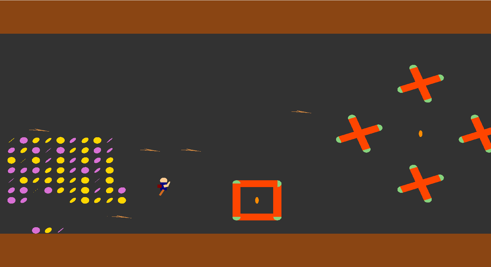
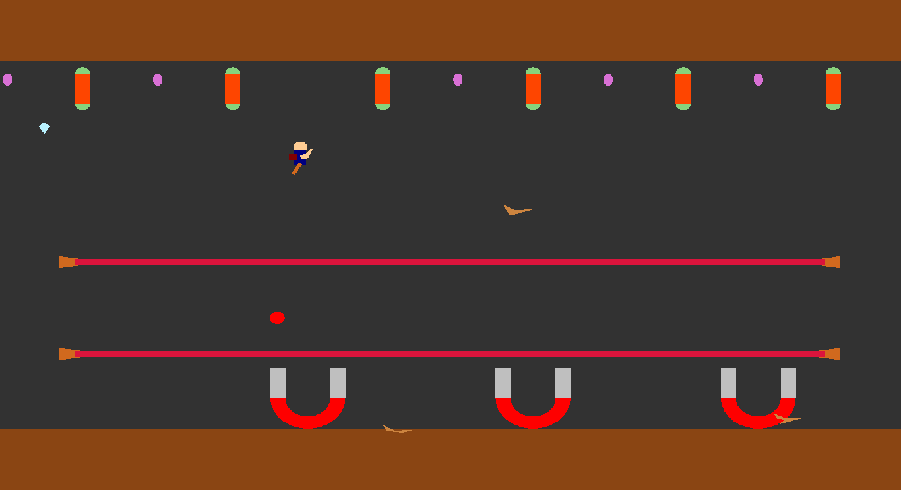

Gravity Joyride
=========================

A game where the player moves in space collecting coins, powerups escaping from enemies and killing them.

###Snaps
Here are some snap shots of the game 
  

###How to run?
To install the game run the file install.sh after downloading 
cmd: `install.sh` 
To run the game run the file install.sh with '-r' argument 
 cmd: `install.sh -r` 

###How to play?
<kbd>&uarr;</kbd>  &nbsp;&nbsp;&nbsp;&nbsp;&nbsp;&nbsp;&nbsp; - &nbsp;move upwards 
<kbd>&larr;</kbd> &nbsp;&nbsp;&nbsp;&nbsp;&nbsp;&nbsp;&nbsp; - &nbsp;move left 
<kbd>&rarr;</kbd> &nbsp;&nbsp;&nbsp;&nbsp;&nbsp;&nbsp;&nbsp; - &nbsp;move right 
<kbd>Space</kbd> &nbsp;- &nbsp;throw water balls

You will definitely have a great time playing this game. Don't get tired until you reach the destination because there comes the biggest surprise.

###How to report bugs?
Please email to [sritejakittu777@gmail.com](mailto:sritejakittu777@gmail.com) with the bug report.